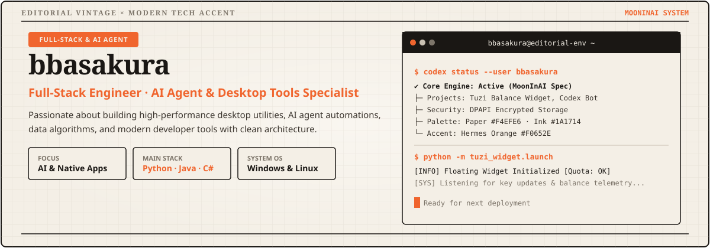
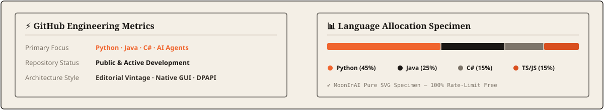

<div align="center">

<!-- MoonInAI 中英文切换按钮 -->
<a href="README.md"></a>
<a href="README.zh-CN.md"></a>

<br/><br/>



</div>

<br/>


### 💡 核心理念与工程方向

- 🚀 **桌面工具与自动化开发**：专注于构建高性能、原生的 Windows 悬浮组件与跨平台实用工具（Python, C#, PySide/Qt, Node.js）。
- 🤖 **AI 基础设施与 Agent 工具链**：开发 AI Agent 工作流、模型路由、浏览器自动化、本地语音运行时与数据工作流。
- ⚡ **安全架构与数据系统**：重视本地数据隐私保护、Windows DPAPI 密钥加密存储、模块化设计与高并发量能算法。

```text
开发者身份 : 全栈工程师 · AI 自动化与桌面应用开发者
所在地区   : 中国 (UTC+8)
常用操作系统 : Windows 11 / Linux (WSL2 / Ubuntu)
设计配色规范 : MoonInAI 社论风格 (纸张白 #F4EFE6 · 墨色 #1A1714 · 爱马仕橘 #F0652E)
技术兴趣   : AI Agent 智能体 · 浏览器自动化 · 本地语音运行时 · 核心量能指标
```

<br/>


<div align="center">

#### 💻 编程语言


#### 🛠️ 框架与 GUI 界面库


#### 🤖 AI 与自动化技术栈


</div>

<br/>


<div align="center">

| 项目展示 | 架构特色与核心功能 |
| :--- | :--- |
| **CreatorHub** | **多平台创作者自动化中枢**<br/>• 账号/会话管理与多平台发布工作流<br/>• 采集、下载、互动与风控 API<br/>• 本地优先的浏览器自动化与可测试服务边界 |
| **GPT Live** | **本地实时语音运行时**<br/>• 浏览器语音对话与本地 ASR 回退<br/>• Node.js 运行时与前端回归测试<br/>• 本地优先的数据处理与模型接入 |
| **X Bookmarks Sync** | **X → 飞书书签自动化**<br/>• 复用已登录浏览器状态，无需付费 X API<br/>• 增量去重、整理与飞书多维表同步<br/>• Canonical 自动化脚本与兼容入口分层 |

</div>

<br/>


<div align="center">




</div>

<br/>

---

<div align="center">

<sub>使用 <a href="https://github.com/oil-oil/beautify-github-readme">beautify-github-readme</a> 精心设计 · 遵循 <a href="docs/MoonInAI-配色拆解与设计系统指南.md">MoonInAI 设计规范</a> · 由 <a href="https://github.com/bbasakura">@bbasakura</a> 维护</sub>

</div>
