# yuzong.ai 像素级复刻产品需求与技术架构文档 (PRD)

---

## 1. 产品定位与核心价值

**yuzong.ai** 是一个面向「AI 出海 · 超级个体 · 一人公司」的个人 IP 品牌独立站与商业闭环系统。
站点集成了个人品牌展示、内容分发、自营硬件商城、出海实用工具箱、品牌合作刊例与航线通关成就系统。

---

## 2. 页面与信息架构 (Information Architecture)

```mermaid
graph TD
    Root[yuzong.ai 站点根目录]
    Root --> Home[1. 首页 /]
    Root --> Biz[2. 品牌合作 /biz/]
    Root --> Voyage[3. 688航线 /voyage/]
    Root --> Shop[4. 出海杂货铺 /shop/]
    Root --> Tools[5. 出海工具箱 /tools/]
    Root --> Posts[6. 深度文章 /posts/]

    Home --> H1[个人名片与复古罗盘]
    Home --> H2[航海播报 Ticker]
    Home --> H3[核心战绩数据面板]
    Home --> H4[业务模块四宫格]
    Home --> H5[推荐工具/装备卡片]
    Home --> H6[最新博文流]

    Shop --> S1[商品列表与状态]
    Shop --> S2[商品详情与规格]
    Shop --> S3[省市区三级级联收货地址]
    Shop --> S4[微信/支付宝扫码支付]
    Shop --> S5[订单跟踪与物流查询]

    Tools --> T1[跨境汇款真实到手对比计算器]
    Tools --> T2[多币种实时中间价转换]
    Tools --> T3[平台阶梯手续费与损耗测算]

    Voyage --> V1[8大出海通关站点]
    Voyage --> V2[本地任务打卡与进度持久化]
    Voyage --> V3[拓荒者成就徽章]
```

---

## 3. 核心功能与业务模块设计

### 3.1 首页 (Home - `index.html`)
* **双栏响应式布局**：
  - 左侧固钉导航栏（Rail）：头像印章徽章、动态航海罗盘（SVG 指针摆动）、自动轮播站内快讯播报（Ticker）、社交矩阵外链与即时出海状态灯。
  - 右侧主内容流：Hero 战绩大标题、四大业务方向卡片（我在做什么）、精选工具箱与自营装备、推荐精选长文、页脚声明与全站暗黑/亮色切换。
* **动效与质感**：
  - 纸面纤维微颗粒噪点层（Grain Layer，固定全屏置顶，`pointer-events: none`）。
  - 贝塞尔曲线过渡动画与悬浮微升（Lift）交互。

### 3.2 品牌合作与媒体刊例 (Biz - `/biz/`)
* **受众画像与曝光数据**：近 90 天 1360 万+ 曝光、5.8 万精准出海决策人群（年龄、地域、认证比例）。
* **合作形式与标准化刊例**：
  - 深度推文评测 / 视频体验。
  - 站点常驻工具/装备挂载。
  - 微信私域与社群联合推广。
* **合作流程**：需求沟通 -> 样品体验 -> 脚本初稿 -> 排期发布 -> 数据复盘。

### 3.3 688 航线通关系统 (Voyage - `/voyage/`)
* **8 站进阶路线图**：
  1. 通网（外网基础环境）
  2. 立号（海外身份、手机号、Apple ID）
  3. 账户（Wise / Stripe 跨境收付款）
  4. 选品（独立开发与出海微产品）
  5. 搭建（Next.js / 静态站极速上线）
  6. 流量（X / Twitter 冷启动与 SEO）
  7. 转化（定价策略与支付网关）
  8. 自动化（一人公司的 AI Agent 自动化矩阵）
* **互动机制**：支持本地 `localStorage` 勾选记录各站任务，动态计算通关进度百分比，达成 100% 触发「新大陆开拓者」成就。

### 3.4 出海杂货铺自营商城 (Shop - `/shop/`)
* **自营硬件与卡品体系**：
  - ENC 美国卡（T-Mobile 原生卡，真实 +1 蜂窝号）
  - Giffgaff 英国电话卡（已充值 / 白卡）
  - XeSIM X2 Pro 智能写卡器（让国行 iPhone / Android 写入多张 eSIM）
* **交易闭环**：
  - 商品多规格选型与动态定价计算。
  - 国内行政区划（省、市、区）标准化级联选择器。
  - 订单创建（`POST /api/create-order`）、支付状态流转（`GET /api/order-status`）与物流轨迹追踪。

### 3.5 跨境汇款透明计算器 (Tools - `/tools/transfer.html`)
* **痛点解决**：揭开跨境电汇与支付平台表面「低手续费」背后的「汇率加价（Spread）」与「中转行扣费」。
* **算法引擎**：
  - 基础汇率实时抓取与中间价对比（`rates` API + 离线 fallback）。
  - 智能路线推荐：根据汇出币种（USD、EUR、GBP、HKD 等）与汇入币种（CNY、USD 等），自动计算：
    $$\text{实际到手} = (\text{汇出金额} - \text{固定手续费}) \times (\text{中间汇率} - \text{平台加价}) - \text{中转行费用}$$
  - 按「到手金额从高到低」动态排序并标记「最划算 (BEST)」标签。

---

## 4. 技术栈与架构规范

* **前端架构**：
  - 纯原生零构建（Vanilla HTML5 + Modern CSS3 + Native ES6 JavaScript）。
  - 零外部 CDN 依赖，字体使用系统安全字体栈（Inter + PingFang SC / Microsoft YaHei + JetBrains Mono）。
  - 全站静态化可部署于 GitHub Pages / Vercel / Cloudflare / Nginx。
* **样式规范**：
  - 核心主色：航海深黛青 `#0b222c`、复古米黄羊皮纸底色 `#f6f3eb`、航海红金点缀 `#d95a2b`、青铜蓝 `#1b6770`。
  - 响应式断点：Mobile (<768px)、Tablet (768px-1024px)、Desktop (>1024px)。
* **API 与数据规范**：
  - `GET /api/rates`：多币种基准汇率。
  - `GET /api/products`：商城商品状态与库存。
  - `POST /api/create-order`：订单生成。
  - `GET /api/order-status`：订单及物流履约查询。

